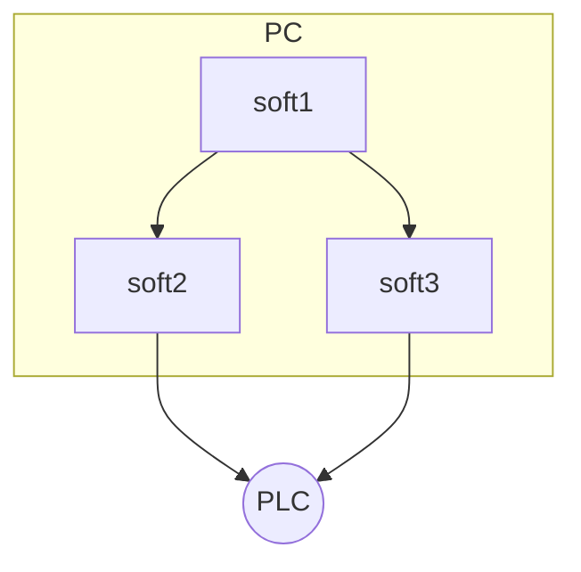

Створення документації на основі
MarkDown: теоретична частина
================================
#### 1. Базовий та елементи розширеного синтаксису MarkDown (MD)

«Markdown» (створена John Gruber’s) — полегшена [мова розмітки даних](https://uk.wikipedia.org/wiki/%D0%9C%D0%BE%D0%B2%D0%B0_%D1%80%D0%BE%D0%B7%D0%BC%D1%96%D1%82%D0%BA%D0%B8_%D0%B4%D0%B0%D0%BD%D0%B8%D1%85), яку створено з ухилом на
прочитність та зручність у публікації з подальшим перетворенням її на структуровану валідність [XHTML](https://uk.wikipedia.org/wiki/XHTML) або [HTML](https://uk.wikipedia.org/wiki/HTML)


рис.1. Принцип роботи застосунків Markdown.

 Екранування
 ===========
зірочка - *

Список
=========

* Пункт в маркованому (ненумерованому) списку
     * Підпункт, відділений 4 пробілами
         * підпункт третього рівня, виділений 4 пробілами
 * Інший пункт в маркованому списку

 1. Пункт в нумерованому списку
2. Інший пункт в нумерованому списку


Код
====
`Hello world!`

```js
for x in "banana":
    print(x)
```

## Цитати
> Весь цей абзац тексту є цитатою і буде поміщений у HTML blockquote елемент.
> Blockquote елементи змінюються в залежності від потреби/пристрою виводу.
> Ви можете обернути довільний текст за власним смаком,
> та воно перетвориться на єдиний blockquote елемент.	

## Таблиці
| Syntax    | Description | Test Text         |
| --------- | ----------- | ----------------- |
| Header    | Title       | Here’s this ----> |
| Paragraph | Text        | And more          |

## Список завдань
- [x] Write the press release
- [ ] Update the website
- [ ] Contact the media

## Емоджі (смайли)

Gone camping! 🏕️ Be back soon.

That is so funny! 😂

# 2.  LaTeX/Mathematics 


$$
\cos(2\beta) = \cos^2 \beta - \sin^2 \beta
$$

$$
\lim_{y \to \infty} \exp(-y) = 0
$$

$$
k_{n+1}=n^3+k^2_n-k{n-1}
$$

$$
n^{22}
$$

$$
f(\alpha) =
\begin{cases}
\alpha / 2 & \text{if } \alpha \text{ is even} \\
-(\alpha + 1)/2 & \text{if } \alpha \text{ is odd}
\end{cases}
$$

# 3. Mermaid

